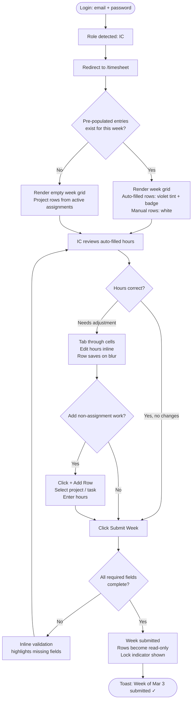
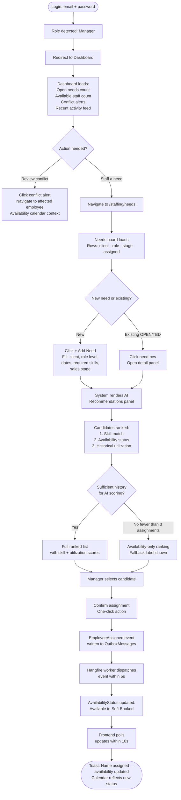
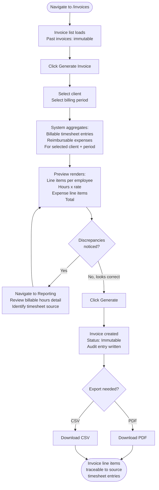
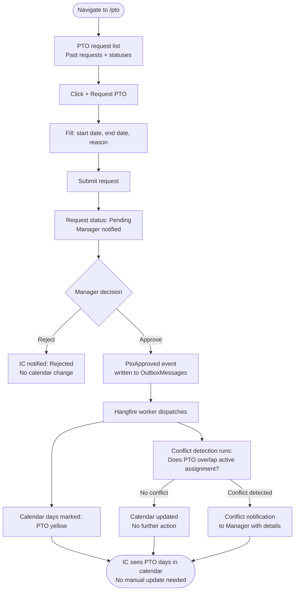

# UX Design Specification — MIS321-GP2

**Author:** Evanc
**Date:** 2026-03-05

---

<!-- UX design content will be appended sequentially through collaborative workflow steps -->

## Executive Summary

### Project Vision

A unified internal business operations platform that replaces two disconnected tools (a Harvest-style system and an Excel Resource Tracker) with a single source of truth. The defining UX promise: operational data stays accurate by default — staffing, availability, timesheets, and forecasting update automatically when real events happen, eliminating manual cross-referencing.

### Target Users

**Individual Contributor (IC):** Primary task is weekly timesheet and expense entry. Needs a fast, low-friction entry experience with clear visibility into their assigned projects. Key delight moment: pre-populated timesheet entries from project assignments.

**Manager:** Primary task is staffing projects and monitoring team utilization. Needs the availability calendar and staffing needs board as their command center. Key delight moment: AI-ranked candidate recommendations surfaced at the moment of need.

**Finance:** Primary task is generating and exporting accurate client invoices. Needs confidence that billable hours are reconciled before invoice generation. Key delight moment: one-click invoice generation from a clean, verified dataset.

**Admin:** Full platform oversight — user management, system configuration, data migration. Needs power-user efficiency and clear visibility into system health (event propagation status, migration results).

### Key Design Challenges

1. **Availability calendar at scale** — rendering 70–100 employees with color-coded statuses in a scannable, filterable grid without visual overload

2. **Seamless multi-step staffing flow** — staffing need creation → AI recommendations → assignment → calendar update must feel like one flow across what are technically multiple modules

3. **Role-differentiated navigation** — four distinct primary workflows sharing one application; default views, navigation hierarchy, and feature prominence must adapt to role without fragmenting the experience

4. **Event feedback UX** — communicating automatic state changes (availability updated, timesheet pre-populated, conflict detected) gracefully without disruptive interruptions or silent surprises

### Design Opportunities

1. **Role-aware dashboard as the Monday morning screen** — a homepage that surfaces forecasting data, client/project status, and team contributions relevant to the logged-in role; eliminates morning context-switching

2. **Staffing board as the showcase feature** — the availability calendar and staffing needs board is the platform's killer feature; investing in its clarity and interactivity is the highest-ROI design decision

3. **Timesheet auto-population as the delight moment** — visually distinguishing pre-populated entries from manual ones and making editing effortless turns a platform capability into a felt experience

---

## Core User Experience

### Defining Experience

Weekly timesheet entry is the highest-frequency action across all roles and must be the fastest, lowest-friction interaction in the platform. The Manager staffing flow — creating a need, reviewing AI recommendations, and assigning an employee — is the platform's showcase interaction and the primary driver of business value. Both must be flawless.

### Platform Strategy

- **Target platform:** Desktop web exclusively at MVP (Phase 3 introduces mobile)
- **Input modality:** Mouse and keyboard primary; no touch optimization required at launch
- **Layout approach:** Information-dense — multi-column layouts, data tables, calendar grids are appropriate and preferred over mobile-first single-column patterns
- **Offline capability:** Not required — internal tool used during business hours on corporate network

### Effortless Interactions

- **Timesheet entry:** Pre-populated rows from project assignments should be the default; users edit and confirm rather than create from scratch
- **Availability check in staffing flow:** Never requires leaving the staffing context — availability status visible inline during assignment creation
- **Invoice generation:** Single action once billable hours are confirmed; no multi-step wizard
- **Expense submission:** Minimal required fields; receipt upload is a single file-attach action, not a separate step

### Critical Success Moments

1. **IC Monday moment:** Employee opens their timesheet and project entries are already populated — the system knew before they had to tell it
2. **Manager staffing moment:** Staffing need is created and ranked AI recommendations appear immediately — Excel is open in another window and never consulted
3. **Finance invoice moment:** Billable hours are clean and verified; invoice generation requires one action and one confirmation
4. **Accuracy moment:** The availability calendar is correct on Monday morning without anyone having manually updated it over the weekend

### Experience Principles

1. **Accuracy by default** — the system maintains correct data automatically through event-driven updates; users should never need to keep things in sync manually

2. **Role-first hierarchy** — every user's primary action is reachable in one click from their landing view; the app reorganizes itself around the logged-in role

3. **Confirm, don't interrupt** — automated state changes (pre-populated timesheets, availability updates, conflict alerts) surface as reviewable notifications, never as blocking interruptions that halt the user's flow

4. **Trust through traceability** — users can always see where data came from (auto-populated vs. manually entered, which event triggered which change); transparency builds confidence in a system they're being asked to trust completely

---

## Desired Emotional Response

### Primary Emotional Goals

**Confidence** is the primary emotional target. Users are being asked to trust a new system with data that directly affects payroll, invoicing, and staffing decisions. Every interaction must reinforce accuracy and reliability. Secondary goals are **efficiency** (tasks should feel fast and low-friction) and **delight** at automation moments where the system acts before the user has to.

### Emotional Journey Mapping

| Stage | Target Emotion | Design Implication |
|---|---|---|
| First login | Cautiously curious | Familiar patterns; no learning curve on day one |
| During core task | Focused, in control | Clear hierarchy; no visual noise competing for attention |
| Task completion | Relieved, accomplished | Immediate confirmation; clear success state |
| Automation fires | Delighted, surprised | Subtle animation on auto-populated entries; toasts not alerts |
| Something goes wrong | Informed, capable | Plain-language error with a clear next action |
| Daily return | Habitual trust | Platform is accurate without verification; routine reinforced |

### Micro-Emotions

**Trust over skepticism:** Users migrating from Excel will be skeptical. Design must show the source of every data point — who entered it, when, and whether it was auto-populated or manual. Skepticism dissolves when the audit trail is accessible.

**Efficiency over frustration:** Timesheet entry is weekly mandatory work. If it feels like a chore, the platform loses. Pre-population, keyboard navigation, and minimal required clicks are non-negotiable.

**Delight over mere satisfaction:** Automation moments (pre-populated timesheet, calendar status updating instantly after assignment) should have a felt quality — a subtle transition or micro-animation that says "the platform did that for you." Not flashy; just present.

### Emotions to Avoid

- **Anxiety about accuracy** — "Did that save? Did the calendar update?" Solved by immediate confirmation feedback on every state-changing action
- **Overwhelm** — The availability calendar at 70–100 employees can become a wall of color. Solved by smart defaults (filter to own team), progressive disclosure, and clear visual hierarchy
- **Distrust from silent failures** — If an event propagation fails with no feedback, users lose confidence in the whole system. Solved by the admin visibility requirement (ADR-01) and user-facing notification toasts for relevant state changes

### Emotional Design Principles

1. **Confirm everything, silently fail nothing** — every state change produces visible feedback, even if just a brief toast; silent operations erode trust

2. **Show the source** — auto-populated data is visually distinguished from manually entered data; users always know why something looks the way it does

3. **Reward the routine** — weekly timesheet submission and daily availability checks should feel progressively faster as users build habits; familiarity should feel like mastery

4. **Reserve delight for automation** — micro-animations and delight moments are used sparingly and only when the system does something the user didn't have to do themselves; overuse makes them invisible

---

## UX Pattern Analysis & Inspiration

### Inspiring Products Analysis

**Harvest (the system being replaced)**
Harvest's timesheet UX is the known baseline — weekly grid, project/task rows, fast entry. Users are already trained on this mental model. The gap is isolation: nothing connects to staffing, assignments, or forecasting.
- Strength: Low-friction time entry; familiar weekly structure
- Gap: Siloed from every other operational data source

**Linear (project/issue tracking)**
Linear sets the bar for keyboard-first, fast, intentional B2B UX. Status transitions feel earned, not bureaucratic. Empty states are informative, not empty. Micro-animations reward completion without demanding attention.
- Strength: Speed, keyboard navigation, status clarity, micro-animation quality
- Applicable pattern: Keyboard-navigable timesheet rows; subtle entry confirmation animations; clean status badges

**Monday.com / Airtable (board/calendar views)**
Color-coded board and calendar views at scale. Multi-view toggle (table/calendar/board) lets different roles see the same data differently.
- Strength: Color-coded status readable at a glance; inline editing; view flexibility
- Weakness: Visual noise at scale; too many surface-level options competing
- Applicable pattern: Color-coded availability cells; inline staffing need editing; table/calendar view toggle on the availability page

**Notion (information-dense navigation)**
Sidebar hierarchy with icon + label navigation scales across many sections without confusion. Role-aware default pages via bookmarks/favorites.
- Applicable pattern: Collapsible icon sidebar with module labels; pinned role-default view on login

### Transferable UX Patterns

**Navigation:**
- Collapsible left sidebar with icon + label (Notion-style) — scales to 11 modules without overwhelming new users; icons allow collapsed mode for power users
- Role-aware default route on login — IC lands on Timesheet, Manager on Staffing, Finance on Invoices, Admin on Dashboard

**Interaction:**
- Keyboard-navigable timesheet entry (Linear-style) — Tab between cells, Enter to save row, arrow keys to navigate weeks; mouse optional not required
- Inline editing on staffing needs board — click a cell to edit sales stage, assigned employee, dates without opening a separate form
- Command palette (optional power feature) — jump to any module, search employees/clients/projects instantly

**Visual:**
- Color-coded availability status cells (Monday.com-style) using the 4-color system from the PRD: Blue=Fully Booked, Green=Soft Booked, Red=Available, Yellow=PTO — consistent with what users already know from Excel
- Status badges with intentional color + label (not color-only) for accessibility compliance
- Skeleton loaders matching the shape of the content they're replacing — no generic spinners

### Anti-Patterns to Avoid

- **Feature sprawl on hover** (Monday.com failure mode) — every cell having 5+ hover actions creates anxiety; surface only the primary action inline, put secondary actions in a context menu
- **Modal-heavy flows** — opening a full modal for every timesheet entry edit adds friction; prefer inline editing with a save-on-blur pattern
- **Confirmation dialogs for low-stakes actions** — "Are you sure you want to save this timesheet entry?" creates unnecessary friction; reserve confirms for irreversible actions (invoice generation, account deactivation)
- **Color-only status indicators** — fails WCAG 2.2 AA; every color status must have a text label or icon companion

### Design Inspiration Strategy

**Adopt directly:**
- Harvest's weekly timesheet grid layout — familiar to existing users, fast
- Linear's keyboard navigation model for data entry
- Notion's collapsible sidebar navigation pattern

**Adapt for this context:**
- Monday.com's color board → simplified to 4 statuses only, no custom colors, with text labels for accessibility
- Linear's micro-animations → subtler; this is a business tool not a consumer app; restraint is the correct tone

**Avoid:**
- Modal-heavy editing flows common in legacy enterprise tools
- Confirmation dialogs on routine actions
- Color-only status communication

---

## Design System Foundation

### Design System Choice

**TailwindCSS + shadcn/ui** (pre-committed in architecture)

shadcn/ui provides owned, copy-paste components built on Radix UI accessibility primitives. Components live in `src/components/ui/` and are fully customizable via Tailwind CSS variables. No external component library dependency to manage.

### Rationale for Selection

- **Accessibility baseline:** Radix UI primitives handle WCAG 2.2 AA focus management, keyboard navigation, and ARIA attributes — no custom a11y work required for standard components
- **Ownership model:** Components are in the codebase, not a black-box dependency; they can be modified without forking a library
- **Information density:** Tailwind's utility classes make compact table/grid variants straightforward; no fighting an opinionated design system
- **Speed:** shadcn/ui's CLI adds pre-built components in seconds; standard components (Table, Dialog, Form, Select, Badge, Popover, Toast) cover ~80% of the UI surface area

### Implementation Approach

- Initialize via shadcn/ui CLI: `npx shadcn@latest init`
- Add components as needed: `npx shadcn@latest add table dialog form select badge toast`
- All components land in `src/components/ui/` — owned, editable
- Global styles in `src/index.css` via CSS variable design tokens
- Tailwind config extends base theme with project-specific tokens

### Customization Strategy

**Color Tokens (CSS variables in `index.css`):**
```css
/* Neutral base */
--background, --foreground, --muted, --border, --card

/* Brand accent (single color — TBD with stakeholder) */
--primary, --primary-foreground

/* Availability status (fixed by PRD spec) */
--status-fully-booked: #3B82F6;   /* blue-500 */
--status-soft-booked:  #22C55E;   /* green-500 */
--status-available:    #EF4444;   /* red-500 */
--status-pto:          #EAB308;   /* yellow-500 */

/* Semantic */
--destructive (errors), --success (confirmations)
```

**Typography:**
- Font: `Inter` (Google Fonts) or `system-ui` fallback
- Scale: Tailwind default (text-sm for table data, text-base for body, text-lg for section headers)
- Tabular numbers enabled for all numeric columns (`font-variant-numeric: tabular-nums`)

**Density:**
- Table/grid views default to compact row height (`h-9` rows vs. default `h-12`)
- Forms and modals use standard spacing
- Sidebar uses compact icon+label layout

**Dark Mode:** Deferred to Phase 2 — shadcn/ui supports via CSS variables but adds MVP scope without clear user demand.

---

## Defining Core Experience

### Defining Experience

**"Assign someone to a project need and watch the platform update itself."**

The Manager staffing flow is the platform's defining interaction — the moment that proves the integrated system works. When a Manager assigns an employee to a staffing need and their availability status updates automatically, the promise of replacing Excel becomes real and felt.

The IC timesheet submission is equally important for daily adoption: opening the timesheet and finding it pre-populated is the daily proof point for individual contributors that the platform is worth trusting.

### User Mental Model

**Current (broken) mental model:**
Managers maintain two parallel workflows — check Excel for availability, check Harvest for active assignments, cross-reference manually, update Excel, hope others see the change. The mental model is "I manage the sync between systems."

**New mental model being introduced:**
"I tell the system what I decided. It handles the downstream updates." This is a mental model shift, not just a UI change — users must learn that they don't need to update the calendar separately because the assignment already did it. Design must reinforce this shift every time it happens (explicit confirmation, visible status change, no second step required).

**IC mental model:**
Current: "I fill in my timesheet from scratch every Monday."
New: "I review what the system already knows and confirm or adjust."
The pre-populated timesheet must be visually distinct from blank — users need to immediately understand "this was auto-filled, not empty."

### Success Criteria

**Manager staffing flow:**
- Assign an employee to a staffing need in ≤3 clicks from the staffing board
- AI-ranked candidates visible before any manual search is required
- Calendar status change visible within the TanStack Query polling window (≤10s) without a manual page refresh
- No second step required to update the calendar — assignment IS the update

**IC timesheet flow:**
- Pre-populated timesheet entries distinguishable from blank entries at a glance
- Edit or confirm a pre-populated week in ≤60 seconds
- Tab-key navigation through all entry fields without touching the mouse
- Submit confirmation visible immediately; no ambiguity about save state

### Novel vs. Established Patterns

**Established (adopt directly):**
- Weekly timesheet grid (Harvest mental model) — familiar, don't change the shape
- Board/list view for staffing needs (kanban-familiar)
- Form-based PTO requests, expense submission

**Novel (requires clear UX communication):**
- Availability calendar that updates automatically — users must be shown that the update happened (toast + visual state change); they cannot assume it
- Pre-populated timesheet entries — visual distinction (e.g., subtle background tint + "Auto-filled" badge) communicates origin without requiring explanation
- AI candidate recommendations inline during assignment — frame as "suggested," not prescriptive; manager always makes the final call

### Experience Mechanics

**Manager Staffing Flow:**

1. **Initiation:** Manager navigates to Staffing → Needs board. Clicks "Add Need" or opens an existing OPEN/TBD need.

2. **Interaction:** Fills client, role level, start/end dates, required skills. System immediately renders ranked candidate panel alongside the form — candidates sorted by: skill match → current availability → historical utilization. Manager reviews recommendations, selects a candidate.

3. **Feedback:** Inline — selected candidate's availability badge updates to "Soft Booked" in the candidate panel. Toast: "Alex Johnson assigned — availability updated." Calendar polling picks up the change within 10s.

4. **Completion:** Staffing need row shows employee name and "Soft Booked" status. No second action needed. Manager can immediately move to the next need.

---

**IC Timesheet Flow:**

1. **Initiation:** IC navigates to Timesheet. Current week loads with pre-populated rows (auto-filled from active project assignments) shown with a subtle tint and "Auto-filled" label.

2. **Interaction:** IC reviews pre-populated entries. Tabs through hours fields — adjusts any that don't match actual work. Adds manual rows for work not covered by assignments. All entry via keyboard; mouse optional.

3. **Feedback:** Row saves on blur (no explicit save button per row). Hours total updates live in the week summary panel. Unsaved changes indicated by a dot on the row.

4. **Completion:** "Submit Week" button at bottom of grid. Confirmation toast: "Week of Mar 3 submitted." Submitted rows become read-only with a lock indicator. Edit requires explicit "Request Edit" action.

---

## Visual Design Foundation

### Color System

**Primary Brand Color:** Violet (`#7C3AED` / `violet-600`)
Chosen for: strong contrast against the neutral slate base, visually distinct from all 4 availability status colors, professional without being generic blue.

**Full Palette (Tailwind CSS variables):**

```css
/* App shell */
--sidebar-bg:       #0F172A;  /* slate-900  — dark sidebar */
--sidebar-fg:       #F8FAFC;  /* slate-50   — sidebar text */
--sidebar-muted:    #94A3B8;  /* slate-400  — inactive nav items */
--sidebar-active:   #7C3AED;  /* violet-600 — active nav indicator */

/* Content area */
--background:       #FFFFFF;
--surface:          #F8FAFC;  /* slate-50   — card/panel backgrounds */
--border:           #E2E8F0;  /* slate-200 */

/* Text */
--foreground:       #0F172A;  /* slate-900 */
--muted-foreground: #64748B;  /* slate-500 */

/* Brand */
--primary:          #7C3AED;  /* violet-600 */
--primary-hover:    #6D28D9;  /* violet-700 */
--primary-fg:       #FFFFFF;

/* Semantic */
--success:          #16A34A;  /* green-600 */
--destructive:      #DC2626;  /* red-600 */
--warning:          #D97706;  /* amber-600 */

/* Availability status (fixed) */
--status-fully-booked: #3B82F6;  /* blue-500  */
--status-soft-booked:  #22C55E;  /* green-500 */
--status-available:    #EF4444;  /* red-500   */
--status-pto:          #EAB308;  /* yellow-500 */
```

**Contrast compliance (WCAG 2.2 AA):**
- `--foreground` on `--background`: 16.7:1 ✓
- `--primary` on `--background`: 5.8:1 ✓
- `--sidebar-fg` on `--sidebar-bg`: 15.3:1 ✓
- All status colors paired with white text labels for color-blind accessibility

### Typography System

**Font:** `Inter` — loaded via Google Fonts; `system-ui` fallback

| Role | Class | Size | Weight | Usage |
|---|---|---|---|---|
| Page title | `text-2xl font-semibold` | 24px | 600 | Module headers |
| Section header | `text-lg font-medium` | 18px | 500 | Card/panel titles |
| Body | `text-sm` | 14px | 400 | Table data, form labels |
| Caption | `text-xs text-muted-foreground` | 12px | 400 | Helper text, timestamps |
| Badge | `text-xs font-medium` | 12px | 500 | Status badges |

**Numeric columns:** `font-variant-numeric: tabular-nums` on all hours, amounts, and date columns.

### Spacing & Layout Foundation

**Base unit:** 4px (Tailwind default).

**App shell:**
```
┌─────────────────────────────────────────────┐
│  Sidebar (240px / collapsed: 56px)  │ Main  │
│  slate-900 background               │ area  │
│  ─────────────────────────────────  │ ───── │
│  [icon] Timesheet                   │       │
│  [icon] Expenses                    │ Page  │
│  [icon] Projects                    │ cont- │
│  [icon] Staffing      ← active      │ ent   │
│  [icon] PTO                         │       │
│  [icon] Clients                     │       │
│  [icon] Reporting                   │       │
│  [icon] Invoices                    │       │
│  ─────────────────────────────────  │       │
│  [icon] Admin (Admin role only)     │       │
│  ─────────────────────────────────  │       │
│  [avatar] User name / role          │       │
└─────────────────────────────────────────────┘
```

- Max content width: `max-w-7xl` (1280px) centered
- Page padding: `px-6 py-6`
- Table row height: `h-9` (36px) — compact data tables
- Form input height: `h-10` (40px)

### Accessibility Considerations

- All status colors paired with text labels — never color-only
- Focus rings: `ring-2 ring-violet-500 ring-offset-2` on all interactive elements
- Minimum click target: 36px height
- Skip navigation link at app shell top for keyboard users
- `aria-current="page"` on active sidebar item
- `role="status"` on toast notifications
- WCAG 2.2 AA verified on all text/background combinations

---

## Design Direction Decision

### Design Directions Explored

Three directions were evaluated from the established visual foundation (violet primary, slate-900 sidebar, Inter, shadcn/ui):

- **A — Command Center:** Dense full-width tables, keyboard-first, no dashboard layer
- **B — Dashboard First:** Role-aware landing page with metrics, conflicts, activity feed; timesheet with auto-fill pattern
- **C — Split Panel:** Needs board + AI recommendations side by side

### Chosen Direction

**Direction B (Dashboard First) + Direction A's Availability Calendar**

Direction B provides the overall application pattern. Direction A's full-width color-coded availability calendar grid replaces Direction B's calendar treatment — it closely mirrors the existing Excel Resource Tracker layout, minimizing the mental model shift for users on day one.

### Design Rationale

- Dashboard-first landing gives Managers the Monday morning briefing view identified as a critical success moment — metrics, conflicts, and activity feed surfaced immediately on login
- Role-aware homepage means IC lands on Timesheet, Manager on Dashboard, Finance on Invoices — each role sees their primary task first
- The Excel-adjacent availability calendar (same 4-color system, same grid orientation) reduces adoption friction for the most-used view in the existing workflow
- Timesheet auto-fill pattern (purple tint + "Auto-filled" label) visually communicates pre-population without instruction

### Implementation Approach

- Root route (`/`) renders role-aware dashboard component from `stores/authStore`
- Availability calendar (`/staffing`) uses Direction A's full-width grid layout with `useAvailability` TanStack Query hook polling at ≤10s interval
- Timesheet (`/timesheet`) renders auto-filled rows with `bg-violet-50` tint and "Auto-filled" badge; manually added rows use standard white background
- All module views follow Direction B's topbar + content area layout pattern

---

## User Journey Flows

### Journey 1 — IC Weekly Timesheet Submission

**Entry point:** Login → role-aware redirect to `/timesheet` (IC default)



**Key UX decisions:**
- IC never starts from blank — rows pre-populated from assignments reduce Monday effort
- Save-on-blur per row; no explicit per-row save button
- Submit is the only irreversible action; no confirmation dialog on per-row edits
- Post-submit edit requires "Request Edit" (triggers audit log entry)

---

### Journey 2 — Manager Staffing & AI Assignment Flow

**Entry point:** Login → role-aware redirect to `/` Dashboard (Manager default)



**Key UX decisions:**
- AI panel renders alongside the need form/detail — no navigation away to find candidates
- Fallback to availability-only is labeled transparently ("Limited history — showing availability only")
- Assignment is one action; calendar update is automatic and confirmed via toast
- Manager never touches the availability calendar to reflect an assignment

---

### Journey 3 — Finance Invoice Generation

**Entry point:** Navigate to `/invoices`



**Key UX decisions:**
- No multi-step wizard — single form → preview → generate
- Preview shows source data before committing; Finance can verify before generating
- Once generated, invoice is immutable — "Generate New" is the correction path
- Export is available immediately post-generation

---

### Journey 4 — PTO Request to Event Propagation

**Entry point:** IC navigates to `/pto`



**Key UX decisions:**
- PTO approval is the only trigger for calendar update — no manual calendar editing
- Conflict detection surfaces to Manager, not IC
- Both Manager and IC receive confirmation of state change

---

### Journey Patterns

**Entry patterns:**
- Role-aware redirect on login: IC → `/timesheet`, Manager → `/`, Finance → `/invoices`, Admin → `/admin/users`
- All modules accessible from sidebar at any time regardless of default landing

**Confirmation patterns:**
- Every state-changing action produces a toast (bottom-right, 4s auto-dismiss)
- Irreversible actions (invoice generation, account deactivation) use a single inline confirmation prompt — not a blocking modal
- Routine saves (timesheet row edit, expense form) save on blur with no explicit confirmation

**Error patterns:**
- Inline field validation on blur; never block submission until all errors shown
- API errors surface as destructive toast with plain-language message + action link where applicable
- Event propagation failures surface in Admin notification queue; user actions are never blocked waiting for propagation

**Navigation patterns:**
- Breadcrumb in topbar for nested views (Client → Project → Timesheet entries)
- Back navigation always available; no dead ends
- Sidebar active state updates immediately on navigation

### Flow Optimization Principles

1. **Minimum clicks to value** — the defining flows (timesheet submit, staffing assign) require ≤3 user decisions from entry to completion
2. **Progressive disclosure** — complex forms reveal AI panel only after initial fields are filled
3. **Never block on automation** — event propagation happens after user action is confirmed; UI does not wait for propagation before returning control
4. **Error recovery is non-destructive** — all editable states are recoverable; only generation and approval actions are irreversible

---

## Component Strategy

### Design System Components (shadcn/ui — use as-is)

| Component | Used for |
|---|---|
| `Button` | All CTAs, form submissions, inline actions |
| `Input` / `Textarea` | Form fields throughout |
| `Select` | Dropdowns (client, project, role, sales stage) |
| `Form` + `Label` | All form layouts with validation |
| `Table` | Reports, invoice line items, client list |
| `Badge` | Status labels, billable/non-billable flags |
| `Avatar` | Employee avatars in calendar, candidate panel |
| `Dialog` | Confirmation prompts for irreversible actions |
| `Sheet` | Side panels for detail views (client detail, project detail) |
| `Popover` | Date range pickers, filter panels |
| `Toast` (Sonner) | Per-action confirmations (4s auto-dismiss) |
| `Skeleton` | Loading states for all data-fetching surfaces |
| `Tabs` | Module sub-navigation (Availability / Needs Board) |
| `Card` | Dashboard metric panels |
| `Calendar` | Date picker for PTO requests, invoice date range |
| `Progress` | Utilization bars on dashboard |

### Custom Components

#### `AvailabilityCalendarGrid`

**Purpose:** Renders all employees as rows × date columns × color-coded status cells. The platform's most complex UI surface.
**Anatomy:** Filter bar → Employee rows (avatar + name + title) → Date header row → Status cells
**States:** Cell states: `fully-booked` (blue) / `soft-booked` (green) / `available` (red) / `pto` (yellow). Row hover: subtle highlight. Cell click: opens employee detail sheet.
**Variants:** Full org view (default) / My team filter / Date range (2-week / 4-week / 8-week)
**Accessibility:** `role="grid"`, `aria-label` per cell ("Alex Johnson, March 5: Fully Booked"), keyboard navigation across cells
**Location:** `src/features/staffing/AvailabilityCalendar.tsx`

---

#### `TimesheetWeekGrid`

**Purpose:** Editable weekly timesheet table with auto-fill tinting, tab navigation, live hour totals, and submit flow.
**Anatomy:** Week navigator → Column headers (Mon–Fri) → Entry rows → Total row → Submit button
**States per row:** `auto-filled` (violet-50 bg + "Auto-filled" badge) / `manual` (white bg) / `unsaved` (dot indicator) / `submitted` (read-only + lock icon) / `edit-requested` (unlocked pending approval)
**Interaction:** Tab through hour cells; Enter confirms row; blur saves row
**Accessibility:** `role="grid"`, column headers with `scope="col"`, `aria-label` on each input ("Hours for DataPlatform v2, Monday")
**Location:** `src/features/timesheet/TimesheetWeekGrid.tsx`

---

#### `CandidateRankingPanel`

**Purpose:** Renders AI-ranked employee recommendations alongside the staffing need form/detail.
**Anatomy:** Panel header (spark icon + "AI Recommendations" + need context) → Candidate rows (rank badge + name + role + availability + score pills + assign button) → Assign CTA
**States:** `ranked` (full AI scoring) / `availability-only` (fallback, labeled "Limited history — showing availability only") / `loading` (skeleton rows) / `empty` (no candidates match criteria)
**Candidate row states:** Default / Hover (highlight) / Selected (violet border)
**Accessibility:** `aria-label="Candidate recommendations for [need name]"`, rank communicated via text not position
**Location:** `src/features/ai-staffing/CandidateRankingPanel.tsx`

---

#### `StaffingNeedsBoard`

**Purpose:** Inline-editable table of staffing needs with sales stage badges and assignment status.
**Anatomy:** Filter/search bar → Need rows (client + role + dates + skills + stage badge + assignment)
**States per row:** `open` / `tbd` / `assigned` (shows employee name + availability badge) / `reviewing` (AI panel open)
**Inline editing:** Sales stage chip is clickable → dropdown in place. Assigned employee is clickable → opens CandidateRankingPanel.
**Location:** `src/features/staffing/StaffingNeedsBoard.tsx`

---

#### `AppShell`

**Purpose:** Root layout component — dark sidebar + topbar + content area. Handles role-aware nav highlighting and sidebar collapse.
**Anatomy:** `<Sidebar>` (slate-900, 220px / collapsed 56px) + `<TopBar>` (52px) + `<main>` (flex-1 overflow-auto)
**States:** Sidebar expanded (icon + label) / collapsed (icon only, tooltip on hover)
**Role logic:** Admin nav item visible only to Admin role; sidebar reads from `useAuthStore`
**Location:** `src/components/layout/AppShell.tsx`

---

#### `NotificationQueue`

**Purpose:** Persistent notification surface for async system events (event propagation results, conflict detections). Distinct from per-action Toast — these are system events, not responses to user actions.
**Anatomy:** Fixed bottom-right stack. Each item: icon + message + timestamp + dismiss. Max 3 visible; older items collapsible.
**States:** `success` (green border) / `warning` (amber border — conflicts) / `error` (red border — propagation failures)
**Driven by:** `useNotificationStore` Zustand store; events pushed by TanStack Query background refetch detecting new notifications
**Location:** `src/components/NotificationQueue.tsx`

---

#### `AvailabilityStatusBadge`

**Purpose:** Reusable inline status indicator used outside the calendar grid (candidate panel, staffing needs board, employee search results).
**Anatomy:** Colored dot + text label
**Variants:** `fully-booked` / `soft-booked` / `available` / `pto` — matches calendar cell colors exactly
**Note:** Never color-only; always includes text label for WCAG 2.2 AA compliance
**Location:** `src/components/ui/AvailabilityStatusBadge.tsx`

---

#### `WeekNavigator`

**Purpose:** Reusable prev/next week control with current week display. Used in Timesheet and Reporting views.
**Anatomy:** `‹` button + "Week of [date] – [date]" label + `›` button + optional "Today" jump link
**Location:** `src/components/ui/WeekNavigator.tsx`

---

### Component Implementation Roadmap

**Phase 1 — Core (required for MVP launch):**
- `AppShell` — everything else renders inside it
- `TimesheetWeekGrid` — highest-frequency user interaction
- `AvailabilityCalendarGrid` — platform showcase feature
- `CandidateRankingPanel` — Manager staffing flow
- `AvailabilityStatusBadge` — used across multiple modules

**Phase 2 — Supporting (required for full module coverage):**
- `StaffingNeedsBoard` — completes staffing module
- `NotificationQueue` — event propagation feedback
- `WeekNavigator` — reused in Timesheet + Reporting

**Phase 3 — Enhancement (post-launch iteration):**
- Availability calendar view toggle (2-week / 4-week / 8-week)
- Timesheet keyboard shortcut hints overlay
- Dashboard widget customization per role

---

## UX Consistency Patterns

### Button Hierarchy

**Rule:** One primary action per surface. All others secondary or ghost.

| Variant | Usage | shadcn variant |
|---|---|---|
| Primary (violet) | Single dominant CTA: Submit Timesheet, Assign Employee, Generate Invoice | `variant="default"` |
| Secondary | Supporting actions: Save Draft, Export | `variant="secondary"` |
| Ghost | Inline/low-stakes: Edit, View, Cancel | `variant="ghost"` |
| Destructive | Irreversible actions only: Delete Client, Void Invoice | `variant="destructive"` |
| Icon-only | Toolbar actions with tooltips required: prev/next week, collapse sidebar | `variant="ghost" size="icon"` |

**Rule:** Destructive actions always require a `Dialog` confirmation. No other action does.

---

### Feedback Patterns

Two distinct feedback channels — responsibilities never overlap:

**Toast (Sonner) — user-triggered action results:**
- Success: "Timesheet submitted", "Employee assigned"
- Error: "Failed to save — please retry"
- Duration: 4 seconds, bottom-right, auto-dismiss
- Never used for async/background events

**NotificationQueue — system/async events:**
- Event propagation results: "Availability updated for 3 employees"
- Conflict detection: "Alex Johnson has a PTO conflict on April 2"
- Propagation failures: "Timesheet auto-fill failed — manual entry required"
- Persists until dismissed; max 3 visible

**Validation errors** appear inline below the relevant field, not as Toast. Use `text-destructive text-sm` with red field border.

---

### Form Patterns

**Layout:** Single-column for modals/sheets; two-column max for full-page forms.
**Labels:** Always above the field (`Label` component), never placeholder-only.
**Validation:** On blur for individual fields; full validation on submit attempt.
**Required fields:** Asterisk (*) in label, never hidden until submit.

**Submission states:**
- Button shows spinner + disabled during in-flight request
- On success: close modal/sheet + Toast
- On error: keep modal open, show inline field errors, re-enable button

**Inline editing (tables/boards):** Click cell/chip → transitions to `Input` or `Select` in place. Blur or Enter saves. Escape cancels. No save button for single-field inline edits.

---

### Navigation Patterns

**Primary nav:** Sidebar (AppShell). Active item: violet-600 text + violet-100 bg pill.

**Role-aware default routes on login:**
- IC → `/timesheet`
- Manager → `/staffing`
- Finance → `/invoices`
- Admin → `/admin`

**Breadcrumbs:** Not used for top-level nav. Used only for drill-down views (Client → Project → Detail).
**Back navigation:** Browser back is sufficient; no custom back buttons except in full-screen modals.
**Module sub-navigation:** `Tabs` directly below page header. Max 4 tabs per module.
**External links:** `target="_blank" rel="noreferrer"` with external link icon.

---

### Empty States & Loading States

**Loading:** `Skeleton` matching the shape of the content it replaces (table rows, cards, calendar cells). Never a full-page spinner.

**Empty state — no data yet:** Centered icon + heading + single CTA. Example: "No staffing needs yet — Add your first need."
**Empty state — filters active:** "No results match your filters" + "Clear filters" link. No CTA.
**Empty state — no permission:** "You don't have access to this section." No CTA.

---

### Table & Data Grid Patterns

**Row density:** Compact — 36px row height, `py-2 px-3` cells.
**Sortable columns:** Chevron icon on hover; active sort shows solid chevron + column highlight.
**Row hover:** `bg-muted/40`; no row click unless drill-down target exists.
**Action column:** Rightmost, always. Ghost icon buttons, visible on row hover only.
**Sticky header:** Tables with >10 rows use `sticky top-0 bg-background z-10` header.
**Pagination:** Used for reports/invoices (finite, exportable data). Availability calendar shows all rows without pagination.
**Color-coded cells:** Availability palette with text label. Never color alone.

---

### Modal & Overlay Patterns

**Dialog:** Irreversible confirmations only. Destructive action button left, Cancel right (primary focus). Body states the consequence.
**Sheet (side panel):** Detail views — client, project, employee. Slides from right, 480px wide.
**Rule:** Never nest a Dialog inside a Sheet. Never open a Sheet from inside a Dialog.
**`⌘K` / `Ctrl+K`:** Reserved for future command palette — do not bind elsewhere.

---

## Responsive Design & Accessibility

### Responsive Strategy

**Primary target: Desktop (1280px+).** This is an internal business operations platform used at workstations during the workday. All primary flows are designed and optimized for desktop-width screens.

**Supported:** Desktop (1024px–1920px+)
**Degraded but functional:** Tablet landscape (1024px)
**Not supported:** Mobile (<768px) — data-dense surfaces like `AvailabilityCalendarGrid` and `TimesheetWeekGrid` cannot be meaningfully rendered at phone widths without a separate mobile-specific design investment. Deferred post-MVP.

**Extra real estate (1440px+):** Sidebar stays fixed at 220px. Content area uses `max-w-screen-xl mx-auto` to prevent extreme line lengths on ultra-wide monitors. The availability calendar uses full available width to show more date columns.

### Breakpoint Strategy

Using Tailwind's default breakpoints:

| Breakpoint | Width | Behavior |
|---|---|---|
| `sm` | 640px | Not a target; layout may be broken |
| `md` | 768px | Sidebar auto-collapses to icon-only |
| `lg` | 1024px | Minimum supported width — full layout renders |
| `xl` | 1280px | Primary design target |
| `2xl` | 1536px | Content max-width caps; calendar gains columns |

**Sidebar collapse:** Defaults expanded at `lg`+. Auto-collapses to 56px icon-only at `md`. User can toggle at any width.

**Table overflow:** Wide tables use `overflow-x-auto` within the content area. Horizontal scroll is acceptable and expected for data grids.

### Accessibility Strategy

**Compliance target: WCAG 2.2 Level AA** — no relaxation.

**Color contrast:**
- Body text (slate-700) on white: 7.4:1 ✓
- Sidebar text on slate-900: ≥4.5:1 ✓
- Violet primary buttons: white on violet-600 = 4.55:1 ✓ — use violet-700 if audit flags borderline
- Status cells: all include color + text label; text must meet 4.5:1 on its cell background

**Keyboard navigation:**
- Full tab order through all interactive elements
- `AvailabilityCalendarGrid` and `TimesheetWeekGrid`: `role="grid"` with arrow-key navigation between cells
- Sidebar items activated with Enter/Space
- Dialog and Sheet trap focus while open; return focus to trigger on close
- Skip link: `<a href="#main-content" class="sr-only focus:not-sr-only">` in AppShell

**Focus indicators:**
- Tailwind/shadcn default focus rings retained — never `outline: none` without a visible replacement
- Global: `focus-visible:ring-2 focus-visible:ring-violet-500`

**Screen reader support:**
- All icon-only buttons: `aria-label`
- Calendar cells: `aria-label="[Employee], [Date]: [Status]"`
- `CandidateRankingPanel`: `aria-label="Candidate recommendations for [need name]"`
- Loading skeletons: `aria-busy="true"` on container
- Toast success: `role="status"`; Toast error: `role="alert"`
- `NotificationQueue` items: `role="status"` with `aria-live="polite"`

**Motion:**
- All animations use `motion-safe:` Tailwind variant or `useReducedMotion` hook
- Respects `prefers-reduced-motion: reduce`

### Testing Strategy

**Keyboard:** Tab through every primary flow (timesheet submit, staffing assign, invoice generate) keyboard-only before any release.
**Screen reader:** NVDA + Chrome (Windows) as primary test combination given Windows workstation user base.
**Contrast:** `axe-core` integrated in Storybook CI — all new components must pass before merge.
**Browsers:** Chrome (primary), Edge (secondary), Firefox (tertiary). Safari not required.
**Zoom:** All layouts remain usable at 150% browser zoom without horizontal overflow in the main content area.
